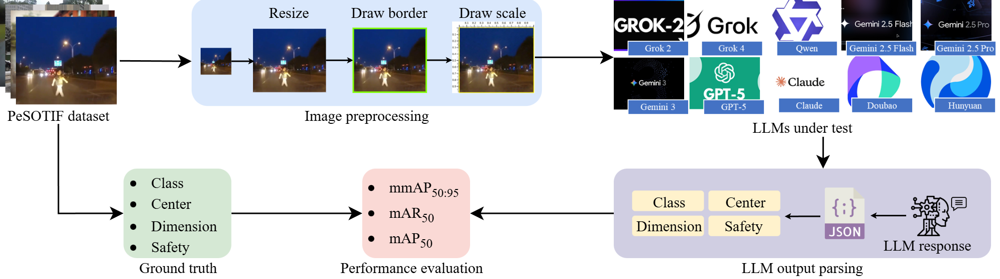
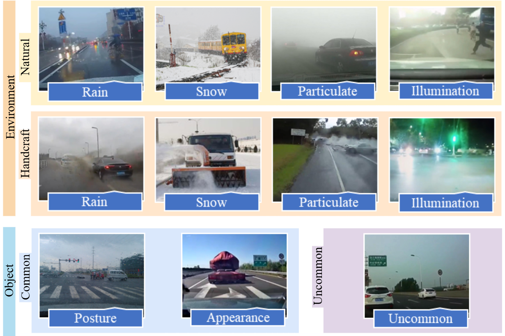
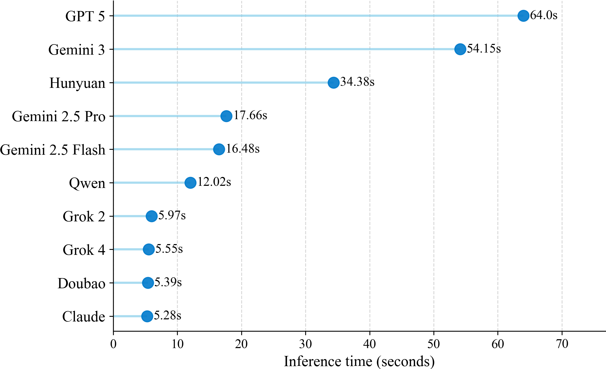
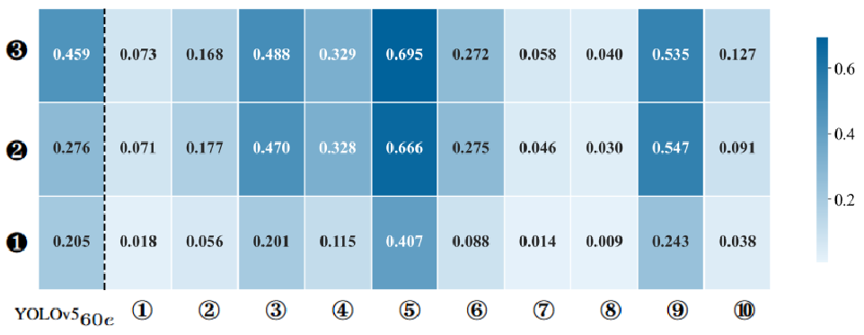
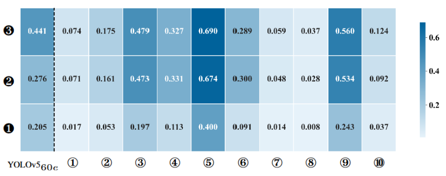
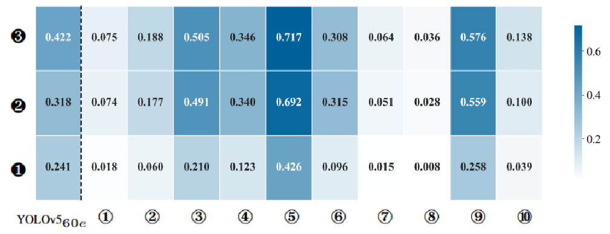
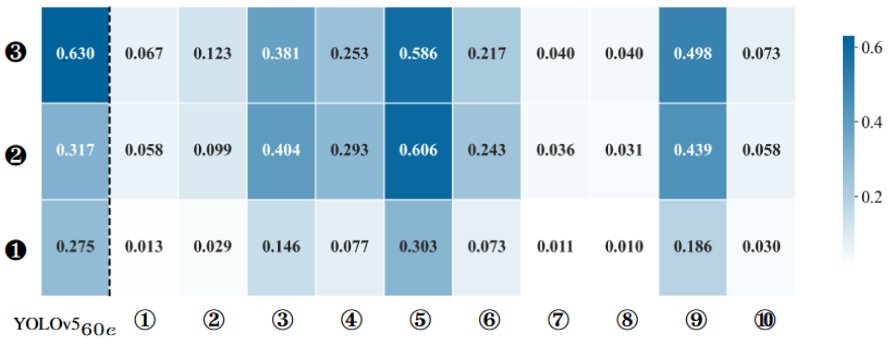
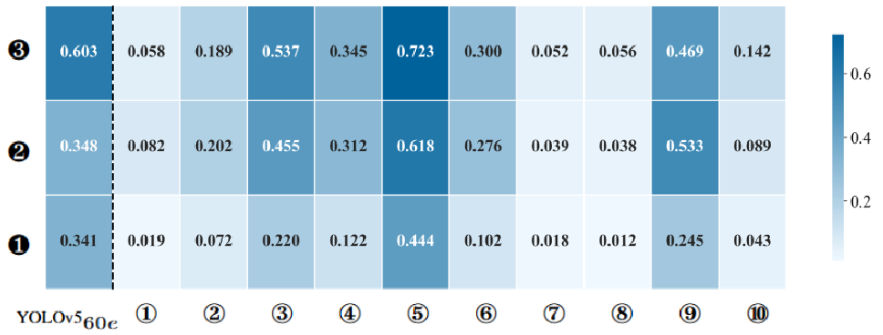
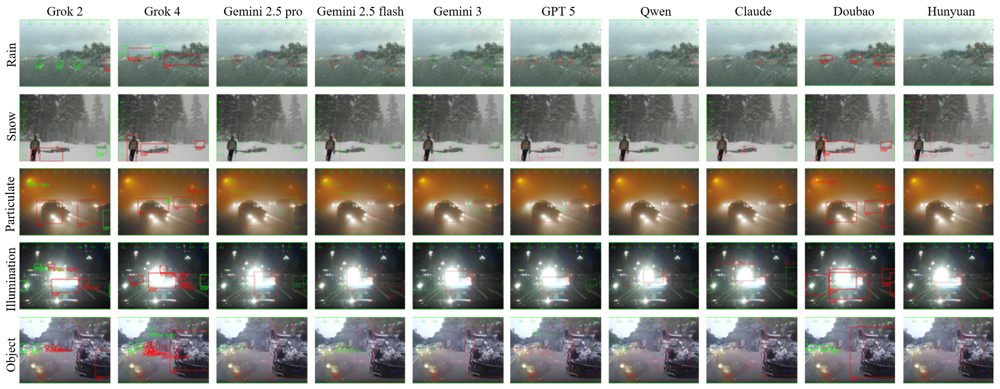

# LLM SOTIF Project: Verification of Large Language Models for Autonomous Driving

## 1. Description

### 1.1 Project Overview
**LLM SOTIF Project** is a research tool designed to evaluate the **Safety of the Intended Functionality (SOTIF)** of Multi-modal Large Language Models (LLMs) in the context of autonomous driving. By utilizing state-of-the-art models such as **Gemini 2.5**, **GPT-5**, **Qwen VL**, **Claude Sonnet**, and **Hunyuan**, this project analyzes their object detection capabilities using dashcam footage. The tool calculates key metrics including **Recall**, **Precision**, and **Intersection over Union (IoU)** to quantify the reliability and potential safety risks of deploying these models in real-world driving scenarios.



### 1.2 Dataset
The evaluation is conducted on the **PeSOTIF dataset**, which contains diverse driving scenarios including adverse weather conditions, long-tail objects, and various road environments to test the robustness of LLMs.



## 2. Experimental Results

### 2.1 Inference Time
The following chart shows the average inference time per image for each model.



### 2.2 Overall Performance Summary
The heatmap below provides a high-level view of the detection performance across the models.



LMMs:① Grok 2; ② Grok 4 ③ Gemini 2.5 Pro; ④ Gemini 2.5 Flash; ⑤
Gemini 3; ⑥ GPT 5; ⑦ Qwen; ⑧ Claude; ⑨ Doubao; ⑩ Hunyuan. Metrics: ❶mmAP50:95; ❷ mAR50; ❸ mAP50.

### 2.3 Whole Set Metrics
*Dataset: 1126 images, IoU Threshold: 0.5*

| Model | Recall | Precision | IoU | Recall < 0.1 (Count) | mmAP@50:95 | Avg Time (s) |
| :--- | :--- | :--- | :--- | :--- | :--- | :--- |
| **Gemini 3-202512** | 0.666 | 0.695 | 0.5 | 55 | 0.407 | 54.00 |
| **Gemini 2.5 pro** | 0.430 | 0.446 | 0.5 | 254 | 0.1344 | 17.66 |
| **Gemini 2.5 flash** | 0.249 | 0.253 | 0.5 | 532 | 0.0935 | 16.48 |
| **GPT 5-0810** | 0.275 | 0.272 | 0.5 | 479 | 0.0882 | 64.00 |
| **Qwen vl max** | 0.046 | 0.058 | 0.5 | 998 | 0.0144 | 12.02 |
| **Claude Sonnet 4-20250514** | 0.030 | 0.040 | 0.5 | 1048 | 0.0089 | 5.28 |
| **Hunyuan t1 vision-20250619**| 0.091 | 0.127 | 0.5 | 890 | 0.0377 | 34.38 |
| **doubao-seed-1-6-vision-250815** | 0.5464 | 0.5340 | 0.5 | 275 | 0.2432 | 5.39 |
| **Grok 2-vision-1212** | 0.0717 | 0.0728 | 0.5 | 918 | 0.0179 | 5.97 |
| **Grok 4-0709** | 0.1768 | 0.1672 | 0.5 | 690 | 0.0561 | 5.55 |

### 2.4 Robustness Analysis
We analyze model performance across different subsets of the PeSOTIF dataset to evaluate robustness against environmental factors, object rarity, and data source.

| Environment Subsets | Natural Subsets |
| :---: | :---: |
|  |  |

| Handcraft Subsets | Object Subsets |
| :---: | :---: |
|  |  |

LMMs:① Grok 2; ② Grok 4 ③ Gemini 2.5 Pro; ④ Gemini 2.5 Flash; ⑤
Gemini 3; ⑥ GPT 5; ⑦ Qwen; ⑧ Claude; ⑨ Doubao; ⑩ Hunyuan. Metrics: ❶mmAP50:95; ❷ mAR50; ❸ mAP50.

### 2.5 Visualizations
Qualitative results demonstrating the detection performance of various LLMs on PeSOTIF images.



## 3. Installation

### 3.1 Pre-requirements
*   **Python installation**: This repository is developed under Python 3.9+.
*   **API Keys**: You will need valid API keys for the models you intend to test (e.g., OpenAI API Key, Google Gemini API Key, Anthropic API Key, etc.).

### 3.2 Setup
1. Clone this repository:
```bash
git clone <repository_url>
cd LLM-SOTIF
```
2. Install all required packages:
```bash
pip install -r requirements.txt
```
3. API Key Setup
It is recommended to set your API keys as environment variables before running the scripts. But passing them as command-line arguments is also possible.
```bash
# For Gemini (Google)
export GOOGLE_API_KEY="your_google_key"

# For Claude (Anthropic)
export ANTHROPIC_API_KEY="your_anthropic_key"

# For GPT (OpenAI)
export OPENAI_API_KEY="your_openai_key"

# For Hunyuan (Tencent)
export HUNYUN_API_KEY="your_hunyuan_key"

# For Qwen (Alibaba)
export QWEN_API_KEY="your_qwen_key"

# For Grok (xAI)
export GROK_API_KEY="your_xai_key"

# For Doubao (ByteDance)
export ARK_API_KEY="your_ark_key"
```

## 4. Operation

### 4.1 Method 1 - Quick Start
To run a quick object detection test on a single image using GPT-4 (or compatible model):
```bash
cd quick_start
python quick_start.py path/to/your/image.jpg <YOUR_OPENAI_API_KEY>
```
*Note: Ensure you provide a valid path to an image file.*

### 4.2 Method 2 - Batch Evaluation
For processing the entire dataset, you can use the model-specific scripts located in the `object_detector` directories.

All scripts follow the same argument structure:

```bash
cd object_detector
python <model_name>_detector.py --input <path_to_images> --output <path_to_results> [options]
```

#### Arguments

| Flag | Long Flag | Description | Default |
| :--- | :--- | :--- | :--- |
| `-i` | `--input` | **Required.** Path to the root folder containing input images. | N/A |
| `-o` | `--output` | **Required.** Path to the root folder where .txt files will be saved. | N/A |
| `-m` | `--model` | Specific model version to use. | Varies by script |
| `-l` | `--limit` | Maximum number of images to process. | 1000 |
| `-k` | `--key` | API Key (overrides environment variable). | None |

#### Examples
**Google Gemini**
```bash
python3 gemini_detector.py -i ./data/images -o ./data/labels -m gemini-2.5-pro
```

## 5. Contributing
Contributions are welcome! Please follow these steps:
1.  Fork the project.
2.  Create your feature branch (`git checkout -b feature/enhancement`).
3.  Commit your changes (`git commit -m 'add some enhancement'`).
4.  Push to the branch (`git push origin feature/enhancement`).
5.  Open a pull request.

## 6. Developers
*   **YONGQI ZHAO**
*   **JI ZHOU**
*   **YILIN DING** 
*   **JIACHEN XU**

## 7. Acknowledgement
This work leverages various libraries and models including `opencv-python`, `openai`, `google-generativeai`, and `anthropic`. Special thanks to the developers of these tools.

